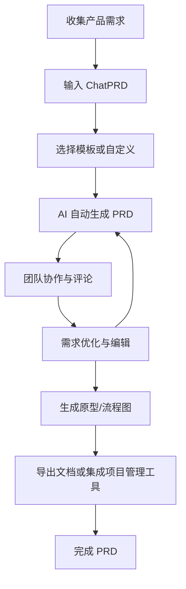

在做产品需求（PRD）时，最耗时间的不只是把内容写出来，而是把零散想法整理成结构清晰、便于评审和落地的文档：目标与范围容易含糊，指标难以对齐，风险点又常在后期才补齐。等草稿反复迭代、来回同步团队之后，效率往往被“空白页 + 反复推敲”拖慢。下面我们来看 ChatPRD 如何把这些痛点变成一套更顺畅的工作流。

## 简介

[ChatPRD](https://www.chatprd.ai/) 是一款专为产品经理（PM）与产品团队打造的 AI 工具，旨在提升产品工作流效率。它如同一位「随叫随到的首席产品官」，帮助你快速起草、打磨并优化产品文档与决策。

## 应用首页

## 核心能力

- **快速起草 PRD**：输入一个简单想法，ChatPRD 即可在片刻间生成完整的产品需求文档（PRD）。

- **文档优化**：粘贴你的 PRD 草稿，即可获得 AI 反馈，帮助理顺叙述逻辑、明确目标，并发现遗漏或风险。

- **目标与指标头脑风暴**：协作制定贴合功能或项目特点的成功指标与目标。

- **内置 PM 辅导**：ChatPRD 在战略、写作清晰度与沟通方面提供指导，如同拥有一位 CPO 导师随时待命。

## 典型工作流

## 示例：为知识工作者设计一款 Markdown 笔记应用

1. 输入提示词，选择 **ChatPRD:PRD** 模板。

2. 等待模型输出。

3. PRD 生成后，你可以通过对话继续优化，或直接编辑输出的 PRD 内容。

## 更多功能

### 自定义模板

- 在 ChatPRD 的 **Customize** 页面，你可以添加模板并设置默认模板，以适配自己的工作流。

### 连接集成

- 你可以将第三方工具与 ChatPRD 连接。

### 定价方案

## 总结

ChatPRD 不只是一款文本生成工具，更是产品管理伙伴：

- 从创意到文档，从辅导到模板，覆盖全流程。
- 可与常用工具集成，并适配你的工作流。
- 让 PM 专注于战略思考，而非面对空白文档无从下笔。
- 定价具有竞争力，提供个人、团队与企业多种方案。

## 参考

- [ChatPRD 文档模板](https://www.chatprd.ai/templates)
- [ChatPRD 博客](https://www.chatprd.ai/blog)
