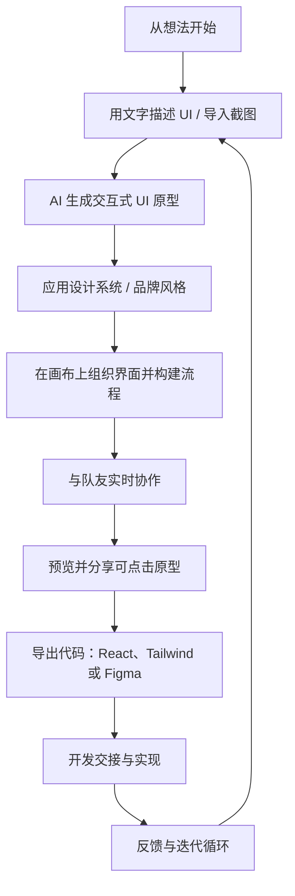

从零开始做网页 UI 原型，再把设计落到可交付的代码里，通常需要在多个工具之间来回切换：既要确保布局与交互符合预期，又要保持样式与设计系统一致。很多时候，你并不是缺少创意，而是被“如何快速开始”和“如何高质量迭代”拖慢了节奏。下面我们看看 Magic Patterns 如何用更顺畅的方式把想法变成可预览、可导出的原型与代码。

## 简介

[Magic Patterns](https://www.magicpatterns.com/) 是一款 AI 驱动的原型设计工具，主要面向产品团队、设计师与开发者。它支持通过文本提示或截图快速创建交互式 UI mockup，生成的原型可匹配现有设计系统，并输出可用于生产的真实代码。

## 应用首页

## 核心能力

- **文本生成 UI**：通过文字描述快速生成界面。

- **截图/网站转换**：将截图或在线网站转换为可编辑 UI。

- **设计系统同步**：同步颜色、字体、间距等设计系统配置。

- **画布组织**：在画布上组织多个页面/屏幕。

- **实时协作**：与团队成员实时协作编辑。

- **预览与分享**：预览并分享交互式原型。

- **代码导出**：直接导出为代码（如 React、Tailwind）或 Figma 文件。

## 典型工作流

## 示例：构建落地页

### 构建落地页

- 使用以下提示词构建落地页：**A landing page showcasing personal work and interests. Japanese-style.**

- 你也可以通过截图、Figma 导入或网站导入来构建页面。
- 可配置用于构建网页的 UI 库，例如 shadcn、chakra。

### 生成结果

### 继续优化

- 选中需要优化的区域，使用提示词「**Change button title to Contact us**」。

### 优化结果

- 下图为优化后的效果；优化完成后，可在新标签页中预览。

### 创建组件

- 选中 **Contact us** 按钮，将其创建为组件。

### 复用组件

- 使用已有组件创建新页面。

### 部署至自定义域名

- 为域名添加 DNS 记录，即可直接访问。

### 导出结果

- 可将结果导出或同步至 [Figma](https://www.magicpatterns.com/docs/documentation/get-started/figma-plugin) / GitHub / Code Zip / LLM Prompt。
- 也可 Fork 当前项目，系统将创建一个相同的新项目。

## 更多功能

### 画布编辑

- 画布可用于在同一页面组织多个设计，如同产品的鸟瞰视图。
- 可直接将代码导入画布并继续编辑，便于团队协作。

### 团队协作

### HTML 转 React 与 Figma

- 使用前需安装 [Chrome 插件：HTML to React & Figma by Magic Patterns](https://chromewebstore.google.com/detail/html-to-react-figma-by-ma/chgehghmhgihgmpmdjpolhkcnhkokdfp)。

### 定价方案

## 总结

Magic Patterns 是一款强大的 AI 原型设计平台，可将文本或截图转化为精致、可导出代码的 UI：

- 支持从提示词到成品的快速迭代，并匹配设计系统。
- 支持实时协作，可直接导出至 Figma 与前端框架。
- 提供画布编辑、组件复用、自定义域名部署等完整工作流。

## 参考

- [Magic Patterns 文档](https://www.magicpatterns.com/docs/documentation)
- [Chrome 插件：HTML to React & Figma by Magic Patterns](https://chromewebstore.google.com/detail/html-to-react-figma-by-ma/chgehghmhgihgmpmdjpolhkcnhkokdfp)
- [Figma 插件：Magic Patterns](https://www.figma.com/community/plugin/1304255855834420274/magic-patterns)
- [导出至 Figma](https://www.magicpatterns.com/docs/documentation/get-started/figma-plugin)
- [Magic Patterns 社区目录](https://www.magicpatterns.com/catalog)
