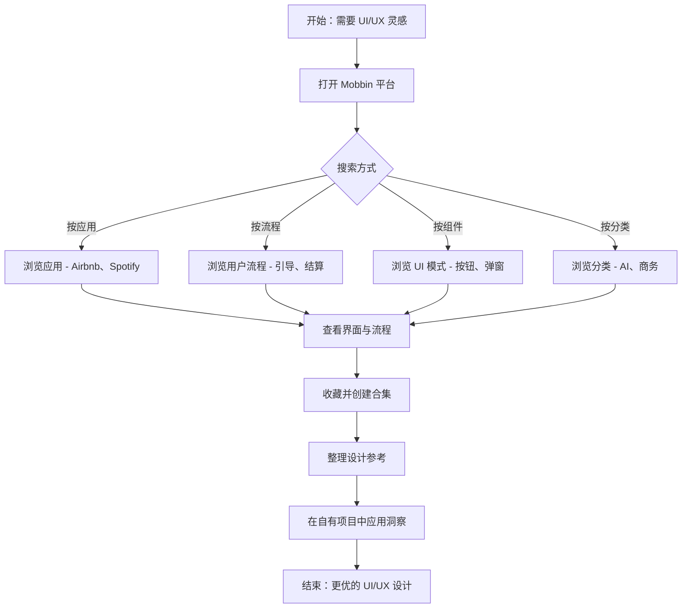

在做 UI/UX 设计时，“找到灵感”只是开始，更难的是把灵感落到当前业务场景：你可能会花时间在 Dribbble / Behance 上翻找截图，但仍然难以获得清晰的用户流程、组件组合与交互逻辑。结果就是评审时反复讨论细节、方案难以快速收敛，进度自然被卡住。下面我们看看 Mobbin 如何把这些信息以更结构化的方式聚合起来，帮助你更快做出决策。

## 简介

[Mobbin](https://mobbin.com/) 是一款 **UI/UX 设计研究平台**，帮助产品设计师、开发者和产品经理研究顶级应用如何解决设计问题。

## 应用首页

## 核心能力

- **设计模式**：按类别浏览示例（如 AI、商业、CRM 等）。

- **用户流程**：完整用户旅程的分步拆解（注册流程、支付流程等）。

- **截图与组件**：高质量界面截图，涵盖 Airbnb、Spotify、Uber、Notion 等热门应用。

- **筛选搜索**：按平台、应用类型、UI 组件或交互方式搜索。

- **收藏夹**：保存并整理参考素材，方便项目管理。

- **团队协作**：在设计/产品团队间共享模式库。

## 典型工作流

## 示例：搜索与浏览应用

### 搜索应用：iOS / Web

- 可直接搜索 iOS 或 Web 应用。

### 应用详情：Mobbin

- 可切换 **Screens / UI Elements / Flows** 标签查看详情。

### 应用截图

### 应用 UI 元素

- 选择需要的 UI 元素进行筛选。

### 应用流程

### 保存收藏

- 可将截图保存至个人收藏夹。

### 收藏截图评论

- 可对已保存的截图添加评论，便于团队协作。

## 更多功能

### 社区收藏

- 可浏览社区中其他用户分享的收藏夹。

### 团队工作区

- 可创建团队空间，与成员协作。

### 定价方案

## 总结

Mobbin 如同一本现代应用设计模式的活百科全书：

- 精选移动端与 Web 应用用户界面库（主要涵盖 iOS、Android 及 Web 产品）。
- 支持**浏览和搜索真实设计模式**（onboarding、登录、结账等）。
- 比 Dribbble / Behance 更结构化、可搜索，是实用的「设计灵感数据库」。

## 参考

- [Mobbin 官网](https://mobbin.com/)
- [Mobbin 博客](https://mobbin.com/blog)
