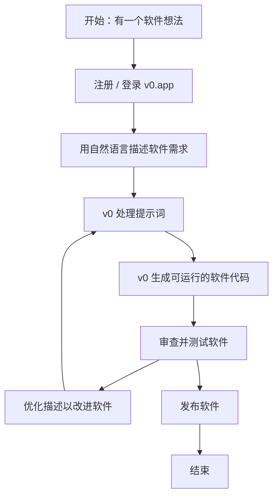

## 简介

[v0.app](https://v0.app/) 是 Vercel 推出的 AI 驱动平台，让任何人都能用自然语言描述将软件想法变为真实可用的 Web 应用——无需编写代码。它如同一位智能 Agent，可生成前后端代码、集成现代开发工具与 API、自动修复代码错误，甚至搜索网络获取实时数据，帮助用户从概念到部署只需数分钟。

## 应用首页

## 核心能力

- **文本生成应用**：只需用自然语言描述需求，即可创建全栈 Web 应用。

- **智能 Agent 能力**：自动检测并修复错误，跨多步骤规划与推理，支持带引用的网络搜索，以及检查在线网站。

- **实时代码编辑与可视化预览**：在浏览器中直接编辑生成的代码，并即时查看视觉反馈。

- **框架集成**：支持 Next.js、Tailwind CSS 等主流框架，并提供 GitHub 版本控制集成。

- **可扩展性**：可在生成的应用中使用自定义 API、数据库与组件。

- **团队协作友好**：弥合设计师、产品经理与开发者之间的协作鸿沟。

- **Agentic AI**：可协作或端到端完成任务，以更少的提示词持续改进应用。

## 典型工作流

## 示例：快速构建落地页

1. 输入提示词，生成落地页。

2. 查看生成结果。

3. 使用提示词优化页面，例如：**Change primary color to blue**。

4. 直接选中 HTML 元素并修改属性。

5. 在项目树中选择文件，直接编辑代码。

6. 创建 GitHub 私有仓库，同步代码变更。

7. 使用 Vercel 发布应用。

## 更多功能

### 项目集成

- 可将项目与 AI 模型和云数据库集成。

> 例如，创建 Supabase 数据库后，使用提示词 _Connect to my Supabase database_，系统会自动安装依赖并配置环境变量以连接 Supabase 数据库。

### 定价方案

## 总结

v0.app 是一款高度易用且功能强大的工具，适合创始人、设计师、开发者与非技术用户，以极少的代码编写成本高效完成原型设计、构建、优化与部署。

## 参考

- [v0.app 文档](https://v0.app/docs/introduction)
- [v0.app API](https://v0.app/docs/api)
- [v0.app 社区](https://community.vercel.com/)
